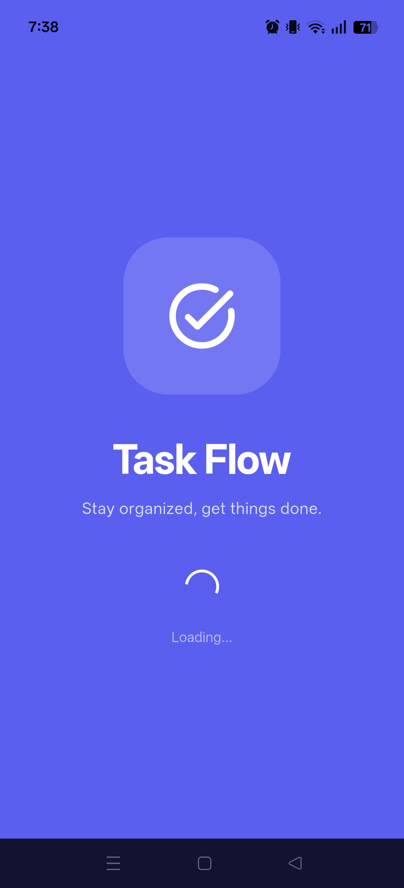
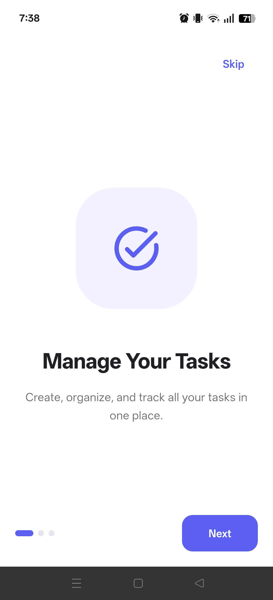
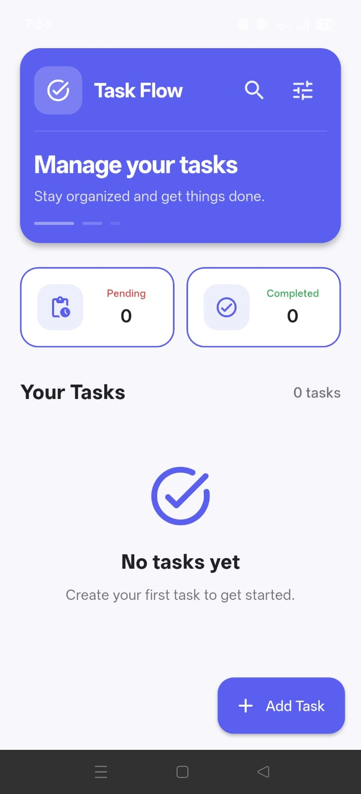
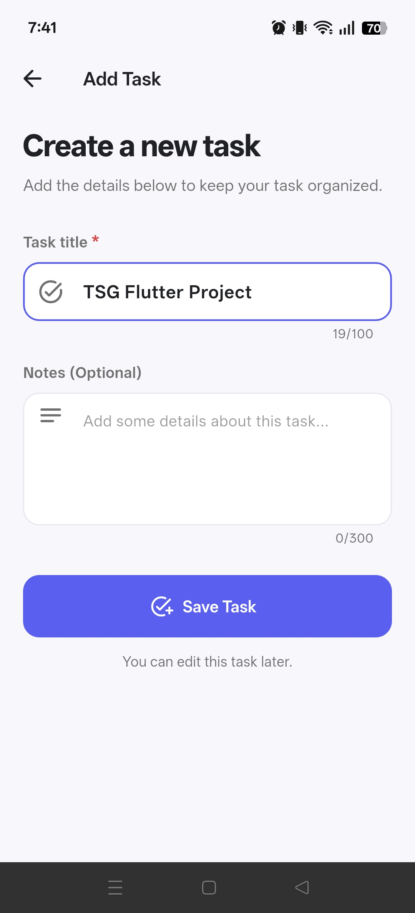
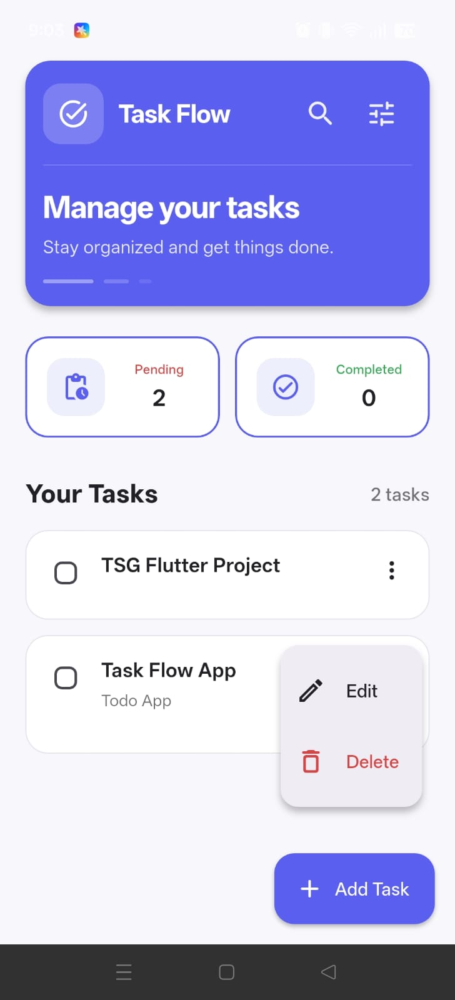
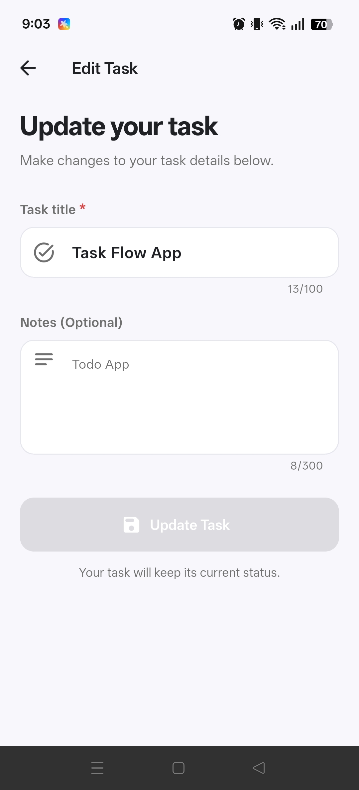
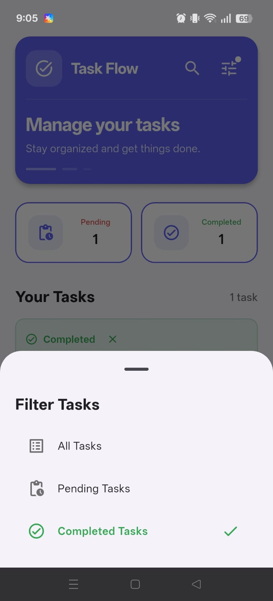
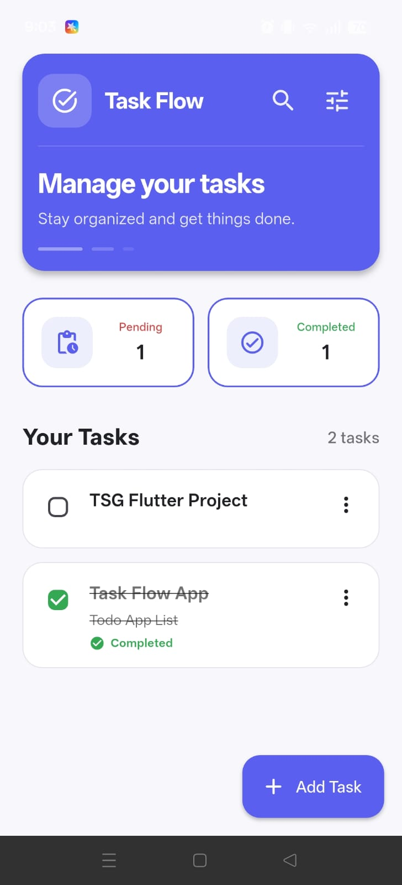
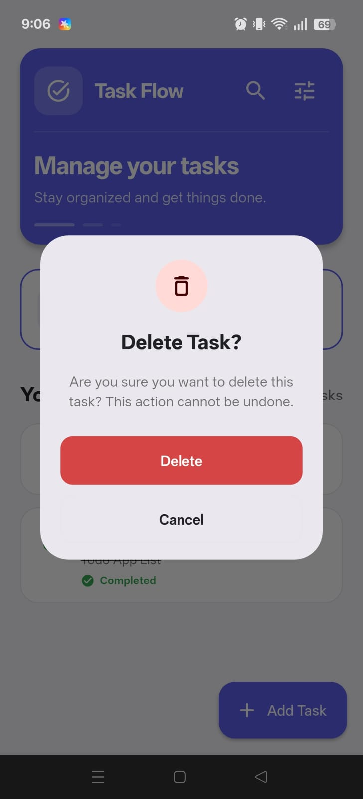
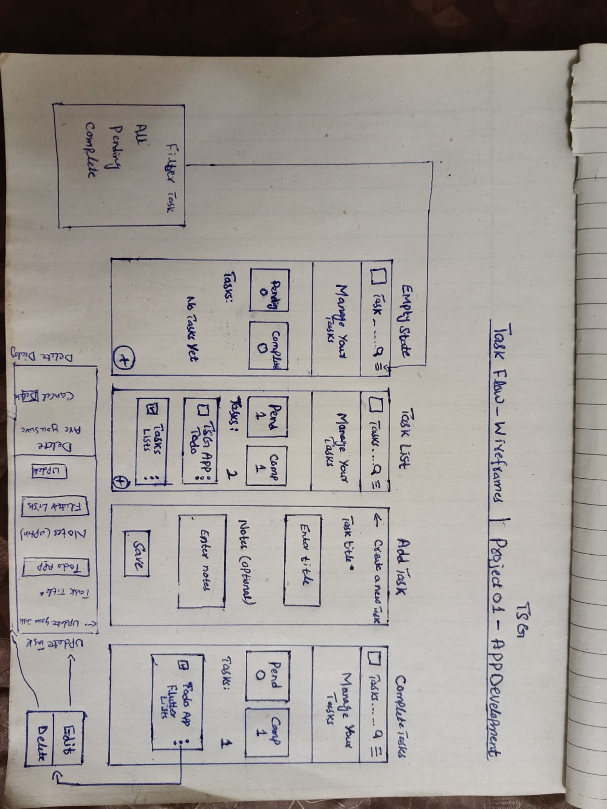

# TaskFlow
A modern and professional Flutter Todo List application designed to help
users create, manage, complete, edit, and delete tasks with reliable local data persistence.

## Overview
TaskFlow is a Flutter-based task management application developed as part of The Sky Gen App Development Project 01.
The application focuses on clean UI, simple task management, local persistence, and proper state management. 
Users can create tasks with an optional note, mark tasks as completed, edit existing tasks, search and filter tasks, and delete tasks with confirmation.

## Features
- **Splash Screen**: Animated splash screen with app name & logo on startup.
- **Onboarding Screen**: First time user introduction with app features.
- **Empty State Screen**: Friendly empty state when no tasks are available.
- **Add Task Screen**: Add new tasks with title and optional note. Validation for empty task title fields.
- **Tasks Screen**: Main screen showing list of all added tasks.
- **Text Widgets**: App name with icon displayed on header.
- **Search Task**: Real time search by title or note.
- **Filter Task**: Bottom sheet with All / Pending / Completed filters.
- **Counter Cards**: Live count of pending and completed tasks.
- **Check Box**: Mark tasks as pending or completed.
- **Edit Screen**: Edit and update existing tasks.
- **Delete Dialog**: Confirmation dialog before deleting a task.
- **Local Persistence**: Tasks remain available after closing the app.

## Buttons
- **Filter Button**: Opens filter sheet.(All,Pending,Completed tasks)
- **FAB**: A button for navigate to add tasks screen.
- **Popup Menu**: Edit or delete tasks option.
- **Edit/Delete Button**: A button edit for edit task screen and delete for delete task with confirmation dialog.
- **Filled Button**: A button for tasks save/update with enable/disable.

### Buttons Logic
- **Enabled**: when title is entered or changes are made.
- **Disabled**: when form is empty or no changes.
- **Loading state**: with loading texts.
- **Color changes**: (gray when disabled, primary when enabled)

## Screenshots
### Splash Screen

### Onboarding Screen

### Empty State

### Add Task

### Task List

### Update Task

### Filter Task

### Completed Tasks

### Delete Task

### Wireframes

## Tech Stack
- **Framework**: Flutter
- **Language**: Dart
- **State Management**: Provider
- **Local Storage**: Hive
- **UI**: Material 3
- **Typography**: Google Fonts - Poppins
- **Development IDE**: Android Studio
- **Version Control**: Git & GitHub
- 
## Architecture
TaskFlow follows a simple layered architecture:

                            UI Screens
                                |
                            TodoProvider
                                |
                            TodoRepository
                                |
                               Hive
                                |
                            Local Device Storage
## Github Link
**GitHub Repository:** [TaskFlow GitHub Repository](https://github.com/Atif798/task_flow)
**Developed By:** Atif Shehzad